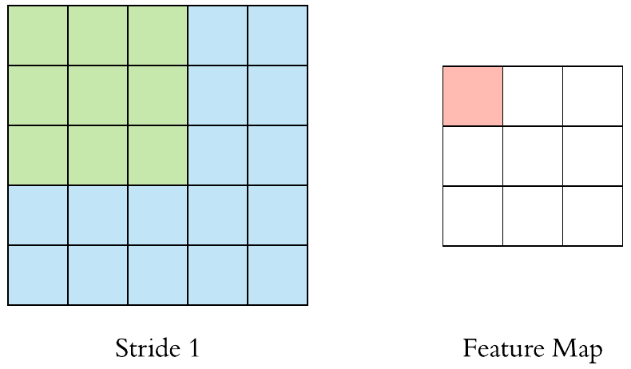
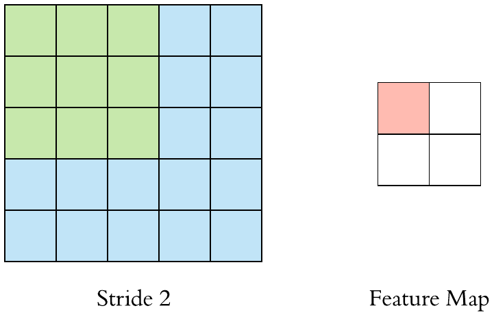
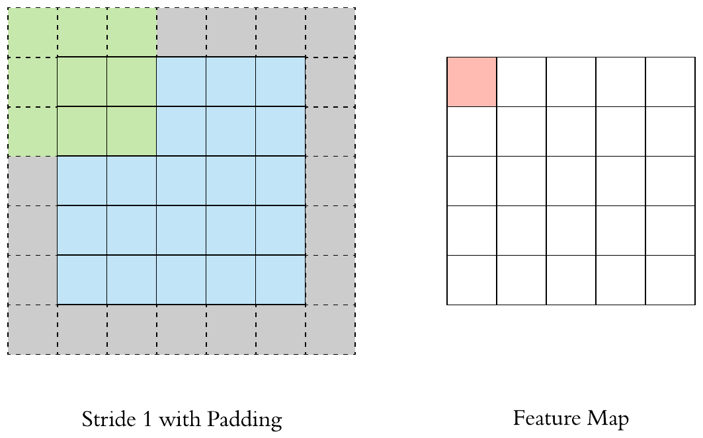
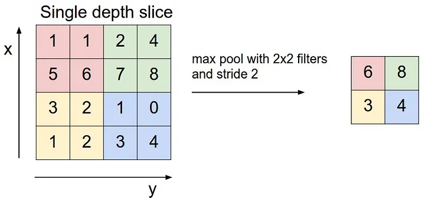

### 解決問題
* 結構化數據 e.g 圖像
* 特徵提取
* 物件追蹤
---
### 架構
* 由[FNN](FNN.md)延伸
* 輸入層（Input Layer）
	* 輸入通常是三維數據（寬度、高度、RGB通道）
* 卷積層（Convolutional Layer）
	* 通過卷積核（Kernal or filters）在圖像上滑動，提取局部特徵
	* 每個卷積核會產生一個特徵圖（feature map）
		* Kernal張數
			* 控制參數量
		* Kernal大小
			* 每個值都是要訓練的參數
			* 藉由調整Kernel大小決定Kernels的特徵接受域 (Receptive field)
			
		* 步長
			* 影響feature map大小
			* 控制圖像長寬尺寸的方式之一
			* 
		* 填充
			* Stride為1
				* 輸出Feature map與輸入圖像維持一樣的尺寸
			* Stride大於1
				* 輸出Feature map寬、高等於輸入影像寬、高/Stride(小數值無條件進位)
			
	* 卷積操作通常會引入非線性激活函數（如 ReLU）以增加模型的非線性能力
* 池化層（Pooling Layer）
	* 用於降低特徵圖的尺寸，減少參數量和計算量
	* 最大池化（Max Pooling）
		* 選取區域內的最大值作為該區域的代表特徵
	* 池化層能夠使特徵對於平移和縮放具有一定的不變性
	
* 全連接層（Fully Connected Layer）
	* CNN 的輸出通常展平成一維數據
	* 通過一個或多個全連接層來進行分類
	* 將提取的特徵映射到輸出空間（如分類標籤）
* 輸出層（Output Layer）
	* 通過 Softmax 生成最終的分類結果
* 輸出維度計算
	* $H_{out} = \frac{H_{in} - K + 2P}{S} + 1$
	* $W_{out} = \frac{W_{in} - K + 2P}{S} + 1$
	* 如果前面計算出來不是整數，可以調整padding或strides
---
### Residual Block
* 適用於所有神經網路，常見於CNN
	* CNN深度都很深
	* 卷積層的特徵擷取會讓特徵變抽象
	* 跳躍連接可以幫特徵保留和增強
* 類似在模型中==買保險==
* 解決身經網路深度增加導致的梯度消失問題
* ==核心概念為把輸入跳層並與輸出相加==
	* 避免訊息丟失
		* 即使這層結果不好，至少還保留了原始的訊息，類似保險機制
		* 隱藏層本身訓練的好，頂多增加訓練時間和計算開銷
	* 梯度更好傳遞
		* 反向傳播時，梯度可以直接跳到更早的層
* 提出shortcut connection (skip connection)，允許跳過一個或多個層，把跳過層的輸出和連接的輸出相加
	1. 輸入 $x$
	2. 卷積層和激活函數 $F(x)$
	3. 輸出 $y = F(x)+x$
* 適用於深度網路與複雜的資料，任務簡單和網路深度不深的時候就不需要使用
```python
import torch
import torch.nn as nn
import torch.nn.functional as F

class ResidualBlock(nn.Module):
    def __init__(self, in_channels, out_channels, stride=1):
        super(ResidualBlock, self).__init__()
        # 第一个卷积层
        self.conv1 = nn.Conv2d(in_channels, out_channels, kernel_size=3, stride=stride, padding=1, bias=False)
        self.bn1 = nn.BatchNorm2d(out_channels)
        # 第二个卷积层
        self.conv2 = nn.Conv2d(out_channels, out_channels, kernel_size=3, stride=1, padding=1, bias=False)
        self.bn2 = nn.BatchNorm2d(out_channels)
        
        # 跳跃连接
        self.shortcut = nn.Sequential()
        if stride != 1 or in_channels != out_channels:
            self.shortcut = nn.Sequential(
                nn.Conv2d(in_channels, out_channels, kernel_size=1, stride=stride, bias=False),
                nn.BatchNorm2d(out_channels)
            )

    def forward(self, x):
        # 正常的卷积层路径
        out = F.relu(self.bn1(self.conv1(x)))
        out = self.bn2(self.conv2(out))
        
        # 跳跃连接路径
        out += self.shortcut(x)
        
        # 激活函数
        out = F.relu(out)
        return out

# 示例：创建一个 Residual Block
# 输入输出通道数为64，stride为1
block = ResidualBlock(in_channels=64, out_channels=64, stride=1)

# 假设输入是一个大小为(1, 64, 32, 32)的张量
x = torch.randn(1, 64, 32, 32)

# 前向传播
output = block(x)
print(output.shape)  # 输出维度与输入维度相同
```


