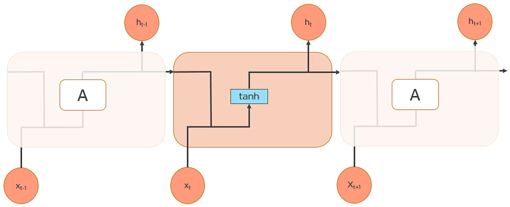
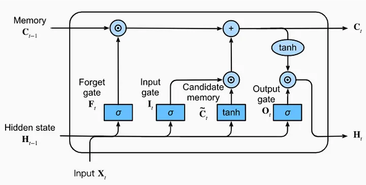
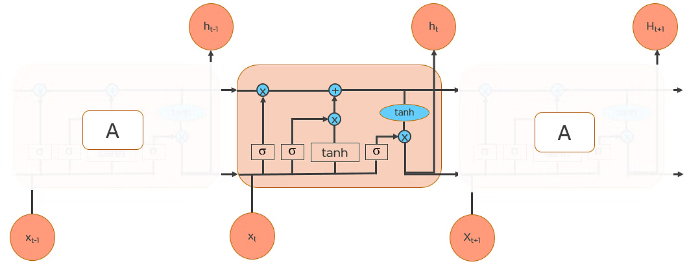
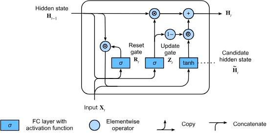

### 解決問題
* 輸出可以不只是一組向量
* 時間序列
* 文本預測
---
### 架構
* 由[FNN](FNN.md)延伸
* 隱藏層每次都把前一次預測的結果當成部分輸入
* hidden layer: 
	* 跟LSTM Output Gate做的事很像，只是全部都做tanh
	* ht​=f(Wh​⋅ht−1​+Wx​⋅xt​+bh​)
	
---
### 常見問題
* [梯度消失](Backpropagation.md#梯度消失)
* [梯度爆炸](Backpropagation.md#梯度爆炸)
---
### Model
#### LSTM
* 設計用來解決RNN梯度消失和梯度爆炸的問題
* 利用記憶單元（Memory Cell）儲存記憶
	* 類似global variable，每次經過門都有可能修改記憶單元
	* 新記憶單元=(遺忘門的值×舊記憶單元)+(輸入門的值×候選記憶單元)
* 利用門（gates）來控制訊息的流動
	* 遺忘門（Forget Gate）
		* 決定先前資訊的遺忘程度
		* 透過sigmod來決定保留程度
	* 輸入門（Input Gate）
		* 決定新資訊有多少要加入記憶單元
		* 透過sigmod決定哪些資訊要輸入
		* 再乘上tanh來產生候選記憶單元
		* $C~t=tanh⁡(WC⋅[ht−1,xt]+bC)$
	* 輸出門（Output Gate）
		* 決定了記憶單元中有多少資訊會被輸出到==下一層或時間步==
		* 先透過sigmod決定哪些記憶要輸出
		* 再乘上tanh來產生最終狀態
			* tanh類似標準化，把資料壓縮到-1~1之間
			* $ht​=ot​⋅tanh(Ct​)$
	
	
	
#### GRU
* 門從LSTM的3個減少為2個，解決LSTM速度較慢的問題
* 利用門（gates）來控制訊息的流動
	* 更新門（Update Gate）
		* 對應到 LSTM 遺忘門和輸入門
		* 決定要保留多少舊資訊和新資訊
		* $zt​=σ(Wz​⋅[ht−1​,xt​]+bz​)$
	* 重置門（Reset Gate）
		* 對應到 LSTM 輸出門
		* 決定計算候選隱藏狀態時，上一狀態的影響程度
		* $rt​=σ(Wr​⋅[ht−1​,xt​]+br​)$
	
	